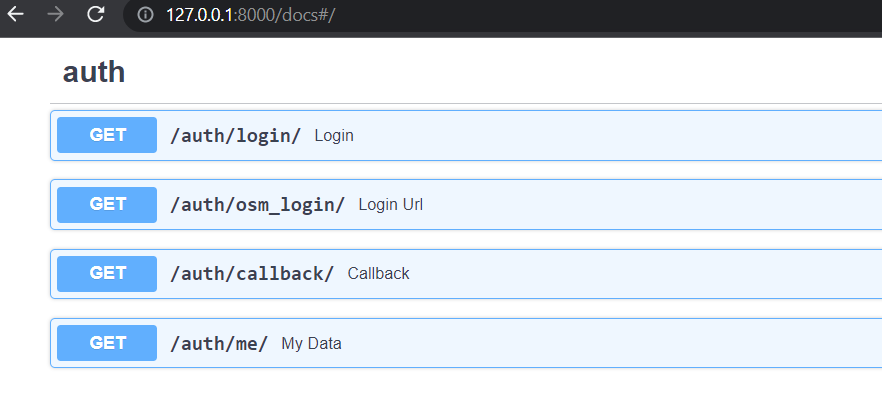

> NOTE: This is an installation guide to quickly get the fmtm app up and running. For a detailed guide on how to install the fmtm app using different methods and contributing, checkout the [dev docs](https://hotosm.github.io/fmtm/dev/Setup/)

# Table of Contents

1. [Software Requirements](#software-requirements)

2. [Setting up the Backend](#setting-up-the-backend)

   - [Fork and Clone the FMTM repository](#fork-and-clone-the-fmtm-repository)
   - [Development: Setup Your Local Environment](#development-setup-your-local-environment)
   - [Start the API with Docker](#start-the-api-with-docker)
   - [Setup ODK Central User](#setup-odk-central-user)
   - [Import Test Data](#import-test-data)
   - [Check Authentication](#check-authentication)

3. [Setting up the Frontend](#setting-up-the-frontend)

   - [Fork and Clone the FMTM repository](#fork-and-clone-the-fmtm-repository-1)
   - [The Microfrontend configuration](#the-microfrontend-configuration)
   - [Start the Frontends with Docker](#start-the-frontends-with-docker)

# 1. Software Requirements <a name="software-requirements"></a>

Before you can install and use this application, you will need to have the following software installed and configured on your system

- Git(or any other Terminal)
- Docker

To install Git, please follow the instructions on the official Git website:

    https://git-scm.com/downloads

To install Docker, please follow the instructions on the official Docker website:

    https://docs.docker.com/engine/install/

# 2. Setting up the Backend <a name="setting-up-the-backend"></a>

## Fork and Clone the FMTM repository

### 1. Fork the repository

Forking creates a copy of the repository in your own GitHub account.
Go to the [Field Mapping Tasking Manager repository](https://github.com/hotosm/fmtm) and click the "Fork" button in the top right corner of the page.

### 2. Clone the forked repository

Clone the forked repository to your local machine using the following command:

`git clone https://github.com/<your-username>/fmtm.git`

Make sure to replace `<your-username>` with your GitHub username.

## Development: Setup Your Local Environment

These steps are essential to run and test your code!

### 1. Setup OSM OAUTH 2.0

The FMTM uses OAUTH2 with OSM to authenticate users. To properly configure your FMTM project, you will need to create keys for OSM.

1. [Login to OSM](https://www.openstreetmap.org/login) (_If you do not have an account yet, click the signup button at the top navigation bar to create one_). Click the drop down arrow on the extreme right of the navigation bar and select My Settings.

2. Register your FMTM instance to OAuth 2 applications. Put your login redirect url as `http://127.0.0.1:8080/osmauth/`, For Production replace the URL as production API Url

> Note: `127.0.0.1` is required instead of `localhost` due to OSM restrictions.


3. Right now _read user preferences permission_ is enough later on fmtm may need permission to modify the map option which should be updated on OSM_SCOPE variable on .env , Keep read_prefs for now.

4. Now Copy your Client ID and Client Secret. Put them in the `OSM_CLIENT_ID` and `OSM_CLIENT_SECRET` of your `.env` file

### 2. Create an `.env` File

Environmental variables are used throughout this project. To get started, create `.env` file in the top level dir, a sample is located at `.env.example`

    cp .env.example .env

Your env should look like this:

```dotenv
### ODK Central ###
ODK_CENTRAL_URL=https://central-proxy
ODK_CENTRAL_USER=`<any_valid_email_address>`
ODK_CENTRAL_PASSWD=`<password_of_central_user>`

### FMTM ###
# DEBUG=True
# LOG_LEVEL=DEBUG
URL_SCHEME=http
API_URL=127.0.0.1:8000
FRONTEND_MAIN_URL=localhost:8080
FRONTEND_MAP_URL=localhost:8081
# API_PREFIX=/api

### OSM ###
OSM_CLIENT_ID=`<OSM_CLIENT_ID_FROM_ABOVE>`
OSM_CLIENT_SECRET=`<OSM_CLIENT_SECRET_FROM_ABOVE>`
OSM_URL=https://www.openstreetmap.org
OSM_SCOPE=read_prefs
OSM_LOGIN_REDIRECT_URI=http://127.0.0.1:8080/osmauth/
OSM_SECRET_KEY=<random_key_for_development>

### Database (optional) ###
CENTRAL_DB_HOST=central-db
CENTRAL_DB_USER=odk
CENTRAL_DB_PASSWORD=odk
CENTRAL_DB_NAME=odk

FMTM_DB_HOST=fmtm-db
FMTM_DB_USER=fmtm
FMTM_DB_PASSWORD=fmtm
FMTM_DB_NAME=fmtm
```

## Start the API with Docker

The easiest way to get up and running is by using the FMTM Docker deployment. Docker creates a virtual environment, isolated from your computer's environment, installs all necessary dependencies, and creates a container for the database, the api, and the frontend. These containers talk to each other via the URLs defined in the docker-compose file and your env file.

### Starting the Containers

1. You will need to [Install Docker](https://docs.docker.com/engine/install/) and ensure that it is running on your local machine.
2. From the command line, navigate to the top level directory of the FMTM project.
3. From the command line run: `docker compose pull`.
   This will pull the latest container builds from **main** branch.
4. Once everything is pulled, from the command line run: `docker compose up -d api`
5. If everything goes well you should now be able to **navigate to the project in your browser:** `http://127.0.0.1:8000/docs`

> Note: If those link doesn't work, check the logs with `docker logs fmtm_api`.

## Setup ODK Central User

The FMTM uses ODK Central to store ODK data.

- By default, the docker setup includes a Central server.
- The credentials should have been provided in your `.env` file to automatically create a user.
- To create a user manually:

```bash
docker compose exec central odk-cmd --email YOUREMAIL@ADDRESSHERE.com user-create
docker-compose exec central odk-cmd --email YOUREMAIL@ADDRESSHERE.com user-promote
```

> Note: Alternatively, you may use an external Central server and user.

## Import Test Data

Some test data is available to get started quickly.

- Navigate to the `import-test-data` endpoint in the API docs page:
  <http://127.0.0.1:8000/docs#/debug/import_test_data_debug_import_test_data_get>
- Click `Try it out`, then `execute`.

## Check Authentication

Once you have deployed, you will need to check that you can properly authenticate.

1. Navigate to `{URL_SCHEME}://{API_URL}/docs`

    Three endpoints are responsible for oauth
    

2. Hit `/auth/osm_login/` : This will give you the Login URL where you can supply your osm username/password

    Response should be like this :

        {"login_url": "https://www.openstreetmap.org/oauth2/authorize/?response_type=code&client_id=xxxx"}

    Now Copy your login_url and hit it in new tab, and you will be redirected to OSM for your LOGIN. Give FMTM the necessary permission

    After successful login, you will get your `access_token` for FMTM Copy it and now you can use it for rest of the endpoints that need authorizations

3. Check your access token: Hit `/auth/me/` and pass your `access_token` You should get your osm id, username and profile picture id

That's it, you have successfully set up the backend!!

# 3. Setting up the Frontend <a name="setting-up-the-frontend"></a>

## Fork and Clone the FMTM repository

### 1. Fork the repository

Forking creates a copy of the repository in your own GitHub account.
Go to the [Field Mapping Tasking Manager repository](https://github.com/hotosm/fmtm) and click the "Fork" button in the top right corner of the page.

### 2. Clone the forked repository

Clone the forked repository to your local machine using the following command:

`git clone https://github.com/<your-username>/fmtm.git`

Make sure to replace `<your-username>` with your GitHub username.

## The Microfrontend configuration

The FMTM frontend is built using a microfrontend architecture, divided into modules that can be developed, tested, and deployed independently.

Webpack remote modules are used to achieve this, dynamically loading code from other microfrontend applications.

In theory, this should improve the performance and scalability of the application.
However, great care should be taken with watching dependency versions across modules, to prevent loading more js content than is required.

List of current microfrontend modules:

- **main**:
  - Description: The main frontend, displays projects and tasks.
  - Location: src/frontend/main
  - Port: 8080.
- **fmtm_openlayers_map**:
  - Description: The map component, displays tasks on a map.
  - Location: src/frontend/fmtm_openlayers_map
  - Port: 8081.

## Start the Frontends with Docker

This is the easiest way to manage multiple frontends at once.

### Starting the Frontend Containers

1. You will need to [Install Docker](https://docs.docker.com/engine/install/) and ensure that it is running on your local machine.
2. From the command line: navigate to the top level directory of the FMTM project.
3. From the command line run: `docker compose build ui-main ui-map`
   This is essential, as the development containers for the frontend are different to production.
4. Once everything is built, from the command line run: `docker compose up -d ui-main ui-map`

5. If everything goes well you should now be able to **navigate to the project in your browser:**
   - **Main:** <http://127.0.0.1:8080>
   - **Map:** <http://127.0.0.1:8081>

That's it, you have successfully set up the frontend!!

> NOTE: For a detailed guide, installation tips and other installation methods, check out the [docs folder](./docs)
