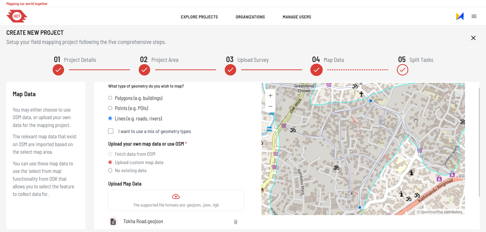

# Steps To Create A Project In FMTM

1. Go to [fmtm][2] .
2. In the header, you'll find two tabs: Explore Projects and Manage Organization.

   

3. Start by exploring the projects listed by different nations and world
   communities for field mapping exercises.
4. Use the search option to narrow down the project cards or find the project
   of your choice.
5. If you are not logged into the system, the "Create new project" button will
   be disabled.
6. If you are new then on the top right corner click on Sign up and create an
   account . Else , Sign in to your existing account .
7. Once signed in, the "Create new project" button will be enabled. Click on it.
8. The process of creating a new project involves four steps: Project Details,
   Uploading the Area, Defining the Task, and Selecting the Form.
9. Start by filling in the project details, including the organization name,
   project name, description, and other relevant information.

   

10. If your organization's name is not listed, you can add it through the
    "Manage Organization" tab.
11. Provide the necessary credentials for the ODK (Open Data Kit) central setup,
    including URL, username, and password.
12. Proceed to the next step, which is uploading the area for field mapping.
    Choose the file option and select the AOI (Area of Interest) file in GEOJSON
    file format.
    Review the displayed map that corresponds to your selected area and click
    on "Next".

    

13. Upload your XLSForm. Here you download pre-defined forms from FMTM.
    Some are specifically designed to work with OpenStreetMap.
    Click on "Next" to proceed.

    

14. In step 4, you can either generate the map features from osm or upload the
    custom map features.
    You can also upload additional map feature to have multiple feature
    selection supported.

    

15. The final step is task splitting which can be performed on three different
    ways. You can split the task on square of size you want. The second option
    is to choose area as task where you can use single polygon as a task. And
    the task splitting algorithm which splits the tasks with average number of
    features which is provided by project creator. The task splitting may take
    few seconds to few minutes considering the feature count and size of AOI.
    Click on "Submit" to create project.

    

16. Wait for the system to generate QR codes for each task, which will be used
    later in the field mapping process.
17. After the project creation is successful and QR codes are generated, you are
    redirected to the project details page of the project.

## Guidelines / Common Questions

### Defining the Project Boundary

- Confirm the exact area for the survey before creating
  the project, as the project boundary cannot be
  edited once the project is created.

#### Preparing Map Features

- Ensure you have the map features ready for the area
  you plan to survey before starting project creation.
- The files should be in GeoJSON format, use the WGS coordinate
  system with EPSG 4326, and must not include
  a Z-coordinate. The map feature file should follow the
  osm tags structure.
- Below is a sample of the required file structure:

```json
{
   "type": "Feature",
   "properties": { "full_id": "r9517874",
      "osm_id": "9517874",
      "osm_type": "relation"
      "tags": {"building": "yes"},
      "type": "multipolygon",
      "name": "",
      "building:levels": "" },
   "geometry": { "type": "MultiPolygon", "coordinates": [ [ [
      [ -3.9618848, 5.3041323 ],
      [ -3.9615121, 5.3041457 ],
      [ -3.9615028, 5.3038906 ],
      [ -3.9618755, 5.3038772 ],
      [ -3.9618848, 5.3041323 ]
   ],
   [
      [ -3.9620167, 5.3042236 ],
      [ -3.9620143, 5.3041258 ],
      [ -3.9619839, 5.3041266 ],
      [ -3.9619757, 5.3037882 ],
      [ -3.9614038, 5.3038019 ],
      [ -3.9614144, 5.3042381 ],
      [ -3.9620167, 5.3042236 ]
   ] ] ] }
},
```

- You may download features from OpenStreetMap (OSM)
  by clicking on Fetch data from osm with FMTM project  
  creation; however, note that FMTM is not responsible  
  for the data quality of features extracted from OSM.
- Currently, available types of survey features are Buildings
  and Healthcare only. We plan to add more types of features moving ahead.
- Project managers can also upload supporting map features.
  Note that these secondary features can’t be surveyed but  
  selected for respective primary features.

#### XLS Form Preparation

- Be prepared with the XLS form for the project.
- If updates are required to the form, you can edit the  
  XLS form even after the project is created.
- Note that a few fields in the beginning and end of  
  the form will be injected to ask for some feature verification.
- So project managers are requested to fill up the  
  form through odk or download the form after the project  
  is created to know about the field injected. You can also  
  get the fields injected from our documentation  
  [Here](https://docs.fmtm.dev/manuals/xlsform-design/#injected-fields-in-the-fmtm-xls-form)

Also read carefully the overview in the left section of
each step to understand the details of the functionalities.

#### Uploading Custom Imagery

If you have custom imagery that you want to use as basemap
during field mapping activity, then you have to add the  
TMS link of that imagery during the first step of project creation.

- Click on _I would like to include my own imagery layer  
  for reference_ in the first step to add TMS URL. You can  
  get the URL by uploading it in openaerialmap.

#### ODK Central Credentials

To store your submissions in ODK Central, you need to  
have valid ODK Central credentials. You can obtain these  
by hosting your own ODK Central server. If you don’t have  
access to a personal ODK Central server, you can use HOT’s  
server by selecting HOT as your organization.

#### During Mapper Training

1. Make sure mapper has downloaded custom odk collect from  
   FMTM website. You can also share the apk file if mappers
   find it difficult to download by themselves.
2. Share the link of the project for the mapper to reach  
   to the project easily. The URL be:
   [https://mapper.fmtm.hotosm.org/project_id](https://mapper.fmtm.hotosm.org/project_id)
3. **Updating Metadata**  
   If you need mappers to include their email  
   and phone number along with their username, guide them  
   to update their ODK Collect settings:
   - Navigate to **Settings** for the project.
   - Click on **User and Device Identity** to update the  
     metadata fields.
4. **Test Submissions**  
   Encourage mappers to submit a few test entries to  
   familiarize themselves with the workflow and address  
   any issues during training.

#### After Training

1. Collect regular ongoing feedback from mappers to ensure they face no difficulties
   during fieldwork.
2. Prepare clear and detailed instructions for mappers
   and validators, specific to the project requirements.
3. Prepare the checklist for validation. The things to
   check may depend on the type of project.
4. Connect the odk central to powerBI or any other data visualisation tool via Odata
   link to customise the charts and graphs as per your need.  
   

To get more info about project management in odk collect  
follow the guide [Here](https://docs.getodk.org/collect-using/).
[2]: https://fmtm.hotosm.org/ "fmtm"

