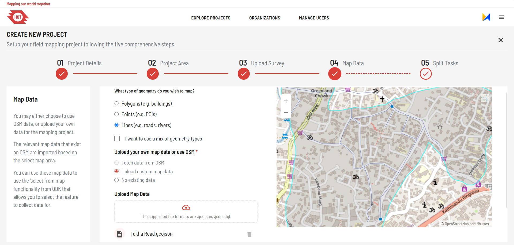

# Project Manager Manual for Field-TM

This manual is a step by step guide for the project managers on how to get
started with the Field Tasking Manager.

## Introduction

A **Mapping Campaign** refers to an organized effort of collecting data
from a particular geographic area/feature and creating maps. This may
involve using various mapping technologies such as; GPS, satellite
imagery, or crowdsourced data. These technologies are used to gather
information about the area of interest.

Mapping campaigns can be carried out for lots of different purposes,
some examples are:

- Disaster Response and Recovery
- Environmental Conservation
- Urban planning or;
- Social and Political Activism.

They often involve collaboration between organizations like; Government
Agencies, Non-profit Groups and volunteers.

Once the data is collected, it is analyzed and processed to create
detailed maps that can have a variety of use cases. These could be:

- Identifying areas of need.
- Planning infrastructure and development projects.
- Understanding the impact of environmental changes on the landscape,
  etc.

## An Overview Of Field-TM In Relation To HOT, OSM and ODK

The **Humanitarian OpenStreetMap Team (HOT**) is a non-profit
organization that uses open mapping data to support humanitarian and
disaster response efforts around the world. **The Field Mapping Task
Manager (Field-TM)** is one of the tools that **HOT** used to coordinate and
manage mapping projects.

**Field-TM** is a software tool that helps project managers to organize and
manage mapping tasks. It assigns those tasks to volunteers and tracks
their progress. The tool includes features for collaborative editing,
data validation, and error detection. This ensures that the data
collected by volunteers is accurate and reliable.

**Field-TM** is designed to be used in conjunction with **Open Data Kit
(ODK)**. **ODK** is a free and open-source set of tools that allows
users to create, collect, and manage data with mobile devices. The
**ODK** provides a set of open-source tools that allow users to build
forms, collect data in the field, and aggregate data on a central
server. It is commonly used for data collection in research, monitoring
and evaluation, and other development projects.

Project managers use **Field-TM** to manage tasks and assign them to
volunteers. The data collected by the volunteer via ODK is typically
uploaded to **OpenStreetMap (OSM)** where it is used to create more
detailed and accurate maps of the affected area. **OSM** is a free and
open-source map of the world that is created and maintained by
volunteers.

Overall, the **Field-TM** tool is an important component of **HOT**'s
efforts to support disaster response and humanitarian efforts around the
world. By coordinating mapping activities and ensuring the accuracy and
reliability of the data collected by volunteers, **Field-TM** helps to
provide critical information that can be used to support decision-making
and improve the effectiveness of humanitarian efforts.

## Prerequisites

- Stable Internet connection.
- Basic bnowledge of field mapping. If you are new to mapping we suggest you
  read [this][1].

## Video Tutorial

<https://github.com/user-attachments/assets/963e7b22-5752-4158-b12d-e67c643235b8>

<https://github.com/user-attachments/assets/969e87e1-581c-4f76-93a7-0b4524b2db3a>

<https://github.com/user-attachments/assets/82b200bc-620a-4712-8d2e-3dcc4c553230>

<https://github.com/user-attachments/assets/03fe2d98-f441-4794-9a0d-5ae49722efed>

<https://github.com/user-attachments/assets/a54ee33c-359c-46f9-b9a4-e58c909569c8>

## Steps to Join An Organization

You may request to join an existing organization.

Alternatively, request the creation of a new organization for your team:

!!! note

        If you are already an organization manager, the button to do this will be
        hidden. Please contact the administrator to create a second organization.

1. Go to the Manage organization tab. You can see the number of organizations.
   On the top, there is a New button, clicking on which you can request
   for a new organization.

2. You have to provide your consent and fill up the form by providing
   necessary details like Organization name, URL, Description of
   organization, type of organization etc.
   

3. Now submit the form. The request will reach the Admin who will approve your
   organization and inform you through the email.
   

For small organisations, the organisation manager may also be the main project
manager.

All project manager permissions are granted to the organisation manager.

## Steps To Create A Project In Field-TM

Project creation access is provided to users who have organisation admin or
higher level of permission.

Go to [fmtm] <https://fmtm.hotosm.org/>

### 1. Create the project details

- Login to fmtm first to see the option of creating the project.

  

- Start by filling in the project basic information such as the name,
  description,
  hashtag, etc. This captures essential information about your project.

- If you want to use drone imagery or any other high resolution base imagery,
  you can add the TMS layer from this step.

- You can also choose whether you want to create public or private project
  in Field-TM.
- You can also choose the option whether you want mappers to use ODK collect
  mobile application or webform during this step. By default, webform will be
  used.

- Finally click Next to proceed.

  

### 2. Create a project area

- You can draw a freehand polygon on a map interface or you can upload
  the AOI file.
- Click on Upload file button to upload the AOI file. The file is only
  supported by Geojson format. See [preparing map features](#preparing-map-features).
- Review the displayed map that corresponds to your selected area and
  click on "Next".

      !!! tip

            Confirm the exact area for the survey before creating the project,
            as the project boundary cannot be edited once the project is created.

      

### 3. Upload the survey (or use an existing one)

- You may choose to upload a pre-Configured XLSForm or browse the forms.
  [XLS Form Preparation](#xls-form-preparation)
- Click the UploadXLSForm if you are uploading the file or download forms
  by clicking Download form.
- Finally click Next to proceed.

  

### 4. Select the geometry type you wish to map

- Select an option under 'What type of geometry?'
- If you want to upload your own, click in Upload custom mapdata or else
  go with the default one of fetch data from OSM.
- You can also go for 'no existing data' option, if you want to collect map
  features as well in field.
- You can also upload additional map feature to have multiple feature
  selection supported.

  

### 5. Task splitting

- Option 1: Split project into squares.
- Option 2: Use the project area created as the task areas.
  This could be a single task, or multiple task areas if uploaded.
- Option 3: The task splitting algorithm which splits
  the tasks with average number of features which is provided by project
  creator.
  - The task splitting may take few seconds to few minutes considering
    the feature count and size of AOI. Click on "Submit" to create project.

    

### Project Creation Tips

#### Preparing Map Features

- Ensure you have the map features ready for the area you plan to
  survey before starting project creation.
- The files should be in GeoJSON format, use the WGS coordinate
  system with EPSG 4326, and must not include a Z-coordinate.
  The map feature file should follow the osm tags structure.
- Below is a sample of the required file structure:

  !!! example

         ```json
         {
            "type": "Feature",
            "properties": { "full_id": "r9517874",
               "osm_id": "9517874",
               "osm_type": "relation"
               "tags": {"building": "yes"},
               "type": "multipolygon",
               "name": "",
               "building:levels": "" },
            "geometry": { "type": "MultiPolygon", "coordinates": [ [ [
               [ -3.9618848, 5.3041323 ],
               [ -3.9615121, 5.3041457 ],
               [ -3.9615028, 5.3038906 ],
               [ -3.9618755, 5.3038772 ],
               [ -3.9618848, 5.3041323 ]
            ],
            [
               [ -3.9620167, 5.3042236 ],
               [ -3.9620143, 5.3041258 ],
               [ -3.9619839, 5.3041266 ],
               [ -3.9619757, 5.3037882 ],
               [ -3.9614038, 5.3038019 ],
               [ -3.9614144, 5.3042381 ],
               [ -3.9620167, 5.3042236 ]
            ] ] ] }
         }
         ```

- You may download features from OpenStreetMap (OSM) by clicking on
  Fetch data from osm with Field-TM project creation; however, note that
  Field-TM is not responsible for the data quality of features extracted
  from OSM.
- Currently, available types of survey features are Buildings and
  Healthcare only. We plan to add more types of features moving ahead.
- Project managers can also upload supporting map features. Note that
  these secondary features can’t be surveyed but selected for respective
  primary features.

#### XLS Form Preparation

- Be prepared with the XLS form for the project.
- If updates are required to the form, you can edit the XLS form even
  after the project is created.
- Note that a few fields in the beginning and end of the form will be
  injected to ask for some feature verification.
- So project managers are requested to fill up the form through odk
  or download the form after the project is created to know about the
  field injected. You can also get the fields injected from our documentation
  [here][2]
- Also read carefully the overview in the left section of each step to
  understand the details of the functionalities.

#### Uploading Custom Imagery

- If you have custom imagery that you want to use as basemap during field
  mapping activity, then you have to add the TMS link of that imagery
  during the first step of project creation.

- Click on _I would like to include my own imagery layer for reference_
  in the first step to add TMS URL. You can get URL by uploading it in
  openaerialmap.

#### ODK Central Credentials

- To store your submissions in ODK Central, you need to have valid
  ODK Central credentials.
- One option is to use your own organisations ODK server, if available.
- Another is to request access to use HOT's ODK server, which is free
  to use for public project creation.

## Steps To View Your Submissions and Infographics

1. Go to the respective project. On the bottom left side,
   you will see the view infographics button.
2. Click on the button will lead you to the infographics page.
   

3. On the right side there is an icon which will switch the layout to
   table view, meaning you can see the submissions in table format.
4. You can see the details of submission and also review the submission
   and set the submission as accepted, rejected or has issues. Moreover,
   you can also comment to the submission for mappers.
   

5. Users can also download the submission in Json or CSV format.
6. The submission can also be uploaded to JOSM. For that, you should
   have JOSM software installed in your device and should have your remote
   control enabled.
   

### Mapper Training

#### During Training

1. Make sure mapper has downloaded custom odk collect from  
   Field-TM website. You can also share the apk file if mappers
   find it difficult to download by themselves.
2. Share the link of the project for the mapper to reach  
   to the project easily. The URL be:
   [https://mapper.fmtm.hotosm.org/project_id](https://mapper.fmtm.hotosm.org/project_id)
3. **Updating Metadata**  
   If you need mappers to include their email  
   and phone number along with their username, guide them  
   to update their ODK Collect settings:
   - Navigate to **Settings** for the project.
   - Click on **User and Device Identity** to update the  
     metadata fields.
4. **Test Submissions**  
   Encourage mappers to submit a few test entries to  
   familiarize themselves with the workflow and address  
   any issues during training.

#### After Training

1. Collect regular ongoing feedback from mappers to ensure they face no difficulties
   during fieldwork.
2. Prepare clear and detailed instructions for mappers
   and validators, specific to the project requirements.
3. Prepare the checklist for validation. The things to
   check may depend on the type of project.
4. Connect the odk central to powerBI or any other data visualisation tool via Odata
   link to customise the charts and graphs as per your need.  
   

To get more info about project management in odk collect  
follow the guide [Here][5].

### Connecting The Data To External Applications

If you want to visualise the submissions and create custom charts
and diagrams using Field-TM submissions, then you can follow the steps
below and load the submissions on any data analysis platform using **OData**.

OData endpoints are a standardised way to ingest
this data into other tools: PowerBI, Tableau, Redash, Grafana.

Why PowerBI? You can use other tools too like Tableau, Redash, Grafana or even
Excel. However, PowerBI is free to use, very powerful, and user friendly to use,
despite being a proprietary Microsoft tool.

The steps shows how to use PowerBI and create custom visualisations.
ODK already has good docs on this which you can refer to.
<https://docs.getodk.org/tutorial-mapping-households/>

Step 1: Start a new project, add a new data source 'OData Feed'

[Image here]

Step 2: Use the OData URLs shown in the ODK docs:
a. Submission data: /v1/projects/{projectId}/forms/{xmlFormId}.svc
e.g. <https://odk.hotosm.org/v1/projects/86/forms/df9135c8-84b1-4753-b348-e8963a8b4088.svc>
b. Entity data: /v1/projects/{projectId}/datasets/{name}.svc
e.g. <https://odk.hotosm.org/v1/projects/86/datasets/features.svc>

Step 3: Enter your credentials using Basic Auth

Step 4: Preview the data

Step 5: Transform data as needed, load into charts, graphs, etc, to create the
dashboard you need.

## Manage project and users

### Steps to Edit Project Details

1. Users can also edit a few fields after project creation like basic
   details like name, description, instructions as well as XLS form.

2. Go to the respective project you want to edit. Click on the
   manage button to edit basic details and XLS form.

   

### Invite Users

You can invite users (mappers and project managers to your project).
If the user already exists in Feild-TM, they will be directly assigned role.

If they are not registered on Field-TM,, the email invitation will
be sent, following which users can get necessary permission to that project.
You can invite users either through osm username or gmail.

1. Choose the mode of invitation, either through osm or gmail.
2. Provide respective osm username or email address. You can invite
   multiple users at a time.
3. Assign the role to users and click on invite.
4. In case of gmail invitation, copy the link and share to that user
   through other media.

## Help and Support

If you encounter any issues or need assistance while using Field-TM, you can access
the following resources:

- Check the [FAQs][3] .
- Ask your doubts in the [Slack channel: #field-mapping-tasking-manager][4]

[1]: https://tasks.hotosm.org/learn/map "If you are new to mapping"
[2]: https://docs.fmtm.dev/manuals/xlsform-design/#injected-fields-in-the-fmtm-xls-form "injected fields"
[3]: https://docs.fmtm.dev/faq "FAQs"
[4]: https://hotosm.slack.com/archives/C04PCBFDEGN "Slack channel: #field-mapping-tasking-manager"
[5]: https://docs.getodk.org/collect-using "Using Collect"
