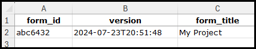

# XLSForm Design (For People In A Hurry)

Adapted and updated from
[this document](https://hotosm.github.io/osm-fieldwork/about/xlsforms/)
in osm-fieldwork.

The full specification for XLSForms can be found [here](https://xlsform.org/en/).
A cheatsheet reference for XLSForm can be found [here](https://datafordev.com/wp-content/uploads/2021/02/datafordev-xlsform-cheat-sheet-v1.pdf).

## XLSForm & ODK Terms

A few terms should be explained:

- **XLSForm**: a spreadsheet containing your survey questions.
  - Simply a `.xls` or `.xlsx` file.
  - Can be created with any tool like Microsoft Excel, LibreOffice Calc.
  - Include text and a small amount of spreadsheet logic to generate values.
- **XForm**: an XLSForm that is converted to XML format read by ODK tools.
- **ODK Central**: the server where XForms are stored, plus related submissions.
- **ODK Collect**: the mobile app to load the XForm to make submissions from.
- **XForm ID**: the ID reference of the XForm in ODK.
- **XForm Title**: the friendly name of the survey form that the user sees.
- **Entity**: a fancy term for map `features`, or commonly for our use case,
  `buildings`. Each Entity is a feature to be mapped.
- **Entity List**: a collection of Entities stored on ODK Central.
- **Choices List**: a group of pre-defined options / answers to a survey
  question.

## XLSForm Sheets (Tabs)

- There are four options for sheet (or tab) names:
  - `settings` - metadata like XForm ID & XForm Title.
  - `survey` - the actual question data to ask the user.
  - `choices` - different options to select are stored.
  - `entities` - metadata about the related Entity list for a project.

### Settings Sheet



- `form_id`: XForm ID above.
- `version`: Can be any value, but it is advised to use a date and time via
  spreadsheet formula `=NOW()`.
- `form_title`: XForm Title above.

### Entities Sheet

- Entities were introduced to ODK Central recently in order to more easily track
  the same feature over time.
- We now have a nice way to store a feature, with geometry and properties, in
  ODK Central (for example the buildings you wish to map!).
- The geometry can then be selected in ODK Collect survey questions.


- `list_name`: The Entity List name in ODK.
- `entity_id`: A reference to a field in your survey sheet, such as building ID.
- `update_if`: If set `true()`, the Entity will be updated on form submission,
  else no update will take place.
- `label`: A descriptive user-facing name for the Entity. This can include logic
  to add text or symbols based on a field in the survey sheet (for example,
  mapping status).

### Choices Sheet

- Contains options that can be used to answer a survey question.
- These are used instead of 'free text' input for consistent answers.


- `list_name`: The Choices List name that can be referenced in the survey.
- `name`: The value that can be selected as the question answer.
- `label`: A description of the choice, displayed in ODK Collect.

### Survey Sheet

- The main part of the form - the questions for the survey!

## Translations

- Ideally two letter ISO codes should be used, along with a label,
  e.g. `image::english(en)`.
- Note the important thing is consistency of usage. The ISO codes
  are not actually validated. So as long as they match `en`
  throughout the form, everything should work.
- As a consequence, it is entirely valid to use language variants,
  such as `pt-BR` for Brazilian Portuguese, _as long as you are
  consistent_.

### Media Files Gotcha

- In the `choices` label, if you include any translated fields, such
  as `label::spanish(es)`, then references to media files **must**
  also be translated.
- For example, you need to have an image field for every available
  translation in your form: `image::english(en)=file.jpg` and
  `image::spanish(es)=file.jpg`.
- The image file could be the same for each language, or a
  different file for each language.

## Creating Entities

- For the XLSForm to reference an Entity List for data collection, the Entity
  List must first exist in ODK Central.
- There are two ways described below.

### 1. From The ODK Central UI

- Easiest approach via the user interface of ODK Collect.
- First we generate the Entity List via the UI, with all the fields we
  want included:


> A single field `geometry` would be acceptable, but it can be useful to add
> other fields as references, for example including a mapping `status` field.

- Next we need to generate a `.csv` containing our geometries we want to map,
  including the fields we defined above.
- The `geometry` field must be in JavaRosa geometry format.
- Example JavaRosa polygon (semicolon separated):

```java
-8.38071535576881 115.640801902838 0.0 0.0;
-8.38074220774489 115.640848633963 0.0 0.0;
-8.38080128208577 115.640815355738 0.0 0.0;
-8.38077407987063 115.640767444534 0.0 0.0;
-8.38071535576881 115.640801902838 0.0 0.0
```


The example CSV can be downloaded
[here](../images/xlsform-design/entity-features.csv)

- Now this CSV can be uploaded via the UI and the Entity List will be populated.

### 2. Via Entity List XLSForm Upload

- This is quite a convoluted approach, as a **separate** XLSForm must be
  uploaded to do this.
- An example Entity registration form can be found
  [here](../images/xlsform-design/entities_registration.xls).
- In the end, we will have two XLSForms. One for Entity List creation,
  and another for the actual data collection.
- The key part of this form is in the `survey` sheet, where the Entity data
  fields are defined:


- We will cover in the [Survey Sheet](#survey-sheet) section more details of
  the specifics here, but as you can see we have:
  - A field type to help determine which kind of data we have.
  - A field name that should match those defined in the features CSV file.
  - A field label to display to the user.
  - A `save_to` field to specify which Entity field / property the data will be
    saved to when submitted. This should probably match the field name.
- The form to create the Entity List is then uploaded to ODK Central:


### 3. From Code (API)

### Injected Fields in the Field-TM XLS Form

During project creation in the Field Tasking Manager (Field-TM), specific
fields and questions are automatically injected into the XLS form to assess
digitization status and support the data conflation process. Below is an
overview of the injected fields and their purposes:

1. The rows are added to record essential metadata like date, username,
   phone number, device ID and email address of the mapper.
2. We also take the user's realtime location
3. The question for feature selection is added on default to access
   selecting of entity to be mapped during survey.
4. If no feature is selected, the user would be prompted to take a GPS coordinate
   of new feature.
   Note: One of these two options must be filled up to proceed.
5. We also dedicate few rows for calculating OSM ID,
   Task ID and mapping status used on Field-TM.
6. We then ask mappers to answer if the feature exist in reality?
   If yes, user proceeds with form submission.
7. If no, the user is prompted to capture an image (if available) and the form
   is terminated with a message:
   "You cannot proceed with data acquisition if the building does not exist."

The another set of questions injected are digitisation verification related questions.
These questions are used for data conflation process i.e. merging the data to osm.
These questions include:

1. Is the digitized location for this feature correct?
   If incorrect, users are asked: "What is wrong with the digitization?"
   Options provided are:
   Lumped – Multiple buildings digitized as a single polygon.
   Split – A single building digitized as multiple polygons.
   Other – Users can provide a custom explanation in a text field.
   In case of other, user can input the their answer on text form.
2. In all cases, users have the option to upload images to support
   their responses. However, its an optional field.
   The translated fields are also available in multiple languages,
   including French and Spanish.
   Below is the sample of injected fields.

[mandatory_fields (3).xls](https://github.com/user-attachments/files/17975369/mandatory_fields.3.xls)

### Entity Properties

- Entities can have any arbitrary properties added to them.
- All properties stored a **text** data, even if the underlying data
  may be a number, e.g. "2".
- There are a few special properties that that can be added and recognized by
  the system:
  - `geometry`: used to display the entity geometry in Collect / Web Forms.
  - `marker-color`: the colour of a marker symbol, in hex, e.g. #aaccee.
  - `marker-symbol`: point data symbol to use, can be an emoji.
  - `stroke`: the colour of polygon / polyline lines.
  - `stroke-width`: the width of the polygon / polyline lines.
  - `fill`: fill colour used for polygons.
- These properties can be updated within forms, enabling dynamic workflows
  that change entity colours on the map (e.g. green = submitted).
