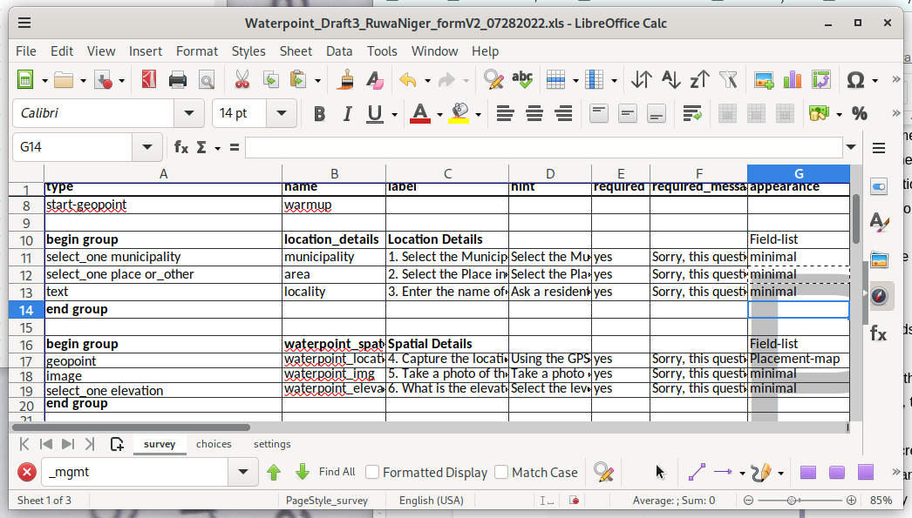
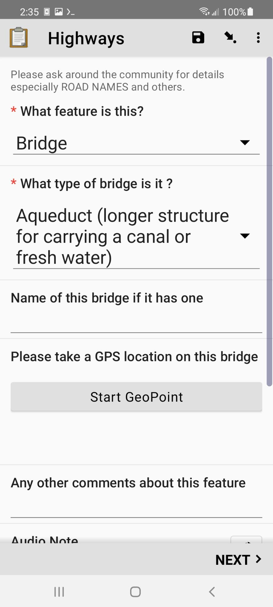
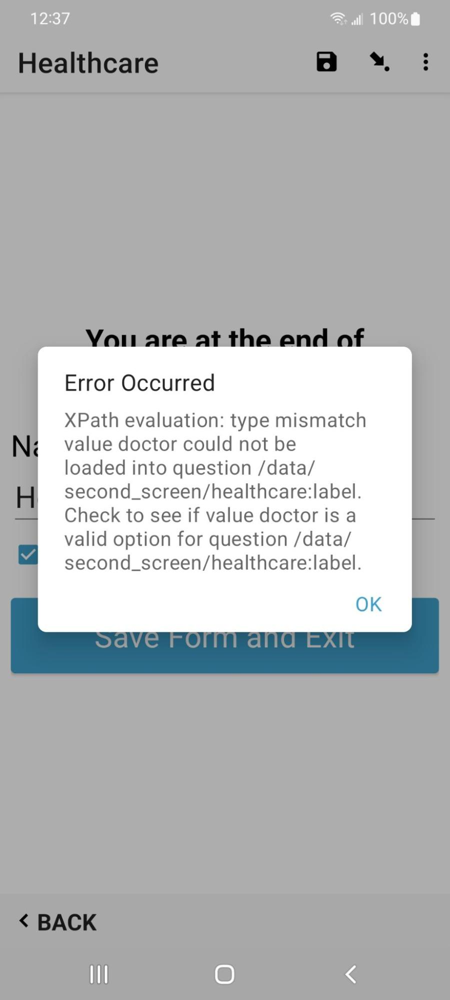

# Improving XLSXForms

## Document Summary

This documents the process of improving XForms for better mapper
efficiency and stability.

Read time; 30mins

Technical Depth: deep dive
- - - - 

## Background

[XLSXForms](https://xlsform.org/en/) are used by [OpenDataKit
(ODK)](https://www.opendatakit.org) to define the input fields for
multiple mobile data collection apps. They have a rather complex
syntax, since the XLSXForms are edited as a spreadsheet. Most of the
XLSXForms I’ve collected don’t utilize more than the basic
functionality of this format. While there are a few web based front
ends for creating and editing XLSXForms, they don’t support many of
the more advanced functionality of XLSXForms. The current only way to
access this functionality is to use a spreadsheet program. To use the
XLSXForm with a mobile app it gets converted using a utility program,
_xls2xform,_ to the XML based XForm used by the apps. 

There are two primary mobile apps used at HOT, OpenMapKit
([OMK](http://www.openmapkit.org/)), and OpenDataKit
([ODK](https://getodk.org/)). OMK uses the same XLSX format as ODK, so
any comments apply to
both. [KoboToolKit](https://www.kobotoolbox.org/) also supports
XLSXForms. This document explains how to improve XLSXForms for more
efficient data collection. Efficiency lets you collect more good data
in less time. 

## OpenDataKit

 [OpenDataKit (ODK)](https://www.opendatakit.org) is both a mobile app
 ([ODK Collect](https://docs.getodk.org/collect-intro/)) for Android,
 and a server ([ODK
 Central](https://docs.getodk.org/central-intro/)). Most of the
 functionality of the OMK app has been migrated to ODK Collect,
 although it works differently. This document also explains how to
 modify old XForms from the OMK app to ODK Collect. ODK Collect is
 actively maintained, and the organization behind it offers various
 support services. 

## OpenMapKit

[OpenMapKit (OMK)](https://www.openmapkit.org) is a Red Cross
 sponsored project for collecting data. It comprises both a server and
 a mobile app. OMK is an android based mobile application, referred to
 onward as OMK. Use of OMK is being deprecated, as it has been
 unmaintained for several years, and its functionality has been added
 to ODK. OMK used special field called **osm** in the **survey** sheet
 (first page of the XLSX file), it then looks at an additional sheet
 called **osm** that replaces the existing **choices** sheet. The
 values in the **osm** sheet are designed to be more closely matched
 to the tagging scheme used by [OpenStreetMap
 (OSM)](https://www.openstreetmap.org/).  

# XLSXForm Syntax

An [XLSXForm](https://xlsform.org/en/) is the source file for OMK and
ODK based tools. This is edited in a spreadsheet program like
LIbreCalc or Excel. There are also online build tools, but they fail
to utilize the full functionality of XLSXForms. The python program
_xls2xform_ converts the spreadsheet to the format used by ODK
Collect. You can also upload the spreadsheet to the ODK Central
server, and it will convert it. 

### Sheet Names

 The sheet names are predefined to have specific functionality as
 follows, and the column headers are used to determine the
 functionality of the value in the cells of the spreadsheet. The
 sheets are Survey, Choices, and Settings. A few columns are required
 to exist in each sheet, the rest are optional. 

* [Survey](https://xlsform.org/en/#the-survey-worksheet)
    * This sheet contains all the questions used for collecting data,
	and refers to the actual values for each question which are on the
	_choices_ sheet.  

    These are the mandatory column headers in the survey sheet:

* **Type** - The type of question, the most common ones are **text**, **select_one**, and **select_multiple.** The second argument in the type column is the keyword used as the **list_name** in the _choices_ sheet for selection menus
* **Name** - Refers to the name of the choice keyword that would be the _tag_ in the output OSM file
* **Label** - Refers to the question the user sees

    The **name** and **label** column headers also support different languages by using a postfix of **::[language](abbreviation) **appended to it, for example **label::Nepali(np)**.

    These are the optional column headers in the survey sheet:

* [Hint](https://xlsform.org/en/#hints) - Optional value display with the question with further information
    * The  **hint** column also supports different languages by using a postfix of** ::[language](abbreviation) **appended to it, for example **hint::Nepali(np)**.
* [Default](https://xlsform.org/en/#default) - Optional default value for a selection.
* [Required](https://xlsform.org/en/#required) - If the value is 1 or _yes_, this field must have an answer. If the value is 0 or _no_ or blank, then it’s optional.
* [Relevant](https://xlsform.org/en/#relevant) - Allows to set up conditional display of questions based on other fields.
* [Appearance](https://xlsform.org/en/#appearance) - This changes how input fields are displayed on the screen. 
* [Choices](https://xlsform.org/en/#the-choices-worksheet)

The choices sheet is used to define the values used for the
**select_one** and **select_multiple** questions on the **survey** 
sheet. 

 The mandatory column headers are:

* **List_name** - This is the name of the list as specified in the **select** type in the _survey_ sheet.
* **Name** - This becomes the _value_ for the _tag_ in the OSM output file.
* **Label** - Refers to what is displayed in the **select** menu.
* The **label** column header also supports different languages by using a postfix of **::[language](abbreviation) **appended to it, for example **label::Nepali(np)**.
* Settings
* This is a simple sheet that contains the version of the sheet, and the title of the input form. The version is used by the server and the mobile apps to track changes in the data format, so it should always be updated after changes are made.

#### Input Types

The Survey sheet has several forms of selecting answers. These allow
the mapper to enter a number, text, or select one or multiple items
from a menu. 

## Mapping Answers to OSM

When designing an XForm whose data is for OSM, the two key columns
that determine the tag & value scheme used in the OSM XML format are
**name** in the _survey_ sheet, which becomes the tag, and **name** in
the _choices_ sheet, which becomes the value.  

# Screen Layout

ODK supports multiple options to change the layout of the input fields
on the screen. In the
[XLSXForm](https://docs.getodk.org/form-question-types/), this is
under the **appearance** column. There’s many possible options
available to change the layout, but here’s a summary of the primary
ones. 

* **Minimal** - Answer choices appear in a pull-down menu.
* **Field-list** - Entire group of questions appear on one screen
* **Parameter-map** - Use a basemap to pick the location
* **Quick** - Auto-advances the form to the next question after an answer is selected

For example, the below screenshot shows the result of the **minimal**
attribute set in the **appearance** column.  

Which then looks like this when the XForm is opened.

* All fields are grouped together to maximize screen space. 
* When the **field-list** attribute is set for **begin_group**, then
multiple questions are on the same screen.
* The screen can be scrolled if there are more input fields than fit.

# Conditionals

ODK can optionally display input fields for questions based on a
selection. Using conditionals allows for a more guided user interface,
than just presenting many questions, some of which aren’t relevant to
the current mapping task. 

## Using Conditionals: 

* Conditionals go in the **relevant** column on the **survey** sheet.
* A conditional has two parts, the variable from the **name** column
of a question, and the value to test against, which is one of the
select values.

In the XLSXForm, the spreadsheet should look like this. The amenity
menu is only displayed if the answer to the “what type of building is
this” is “commercial”.  

|type|name|label|relevant|
|----|----|-----|--------|
|select_one amenity|amenity|Type of Amenity|${building}=’commercial’|

Using conditionals allows for a more dynamic interface, as only
relevant questions are displayed. Some questions may have answers that
only require a few more questions before being complete. Other answers
may generate more questions, for example a commercial building instead
of a residence.

## Grouping

ODK supports grouping survey questions together, which when used with
conditionals in the **relevant** column, and attributes from the
**appearance** column, creates a more dynamic user interface. Groups
allow more than one question on the screen, which is more efficient
than one question per screen, which is the default.

## Using Grouping

* Groups are defined in the **survey** sheet. 
* Using the **appearance** column can display multiple questions on
each screen, minimizing the actions required to enter data.

Sub groups are also supported. When implemented this way, when the top
level group is displayed on the screen, other questions can be
dynamically added to the screen display based on what is selected,
further minimizing required actions. Using the **appearance** column
settings with grouping can create a more efficient user
experience. Ungrouped questions appear one on each screen of the
mobile data collection app, requiring one to swipe to the next page
for each question.

* Begin_group
    * Can use the **relevant** column to conditionally display the entire group of questions
* End_group
    * End the group of survey questions

An example grouping would look like this, and the conditional says to only display this group for commercial buildings.

|type|name|label|relevant|
|----|----|-----|--------|
|select_one type|building|What type of building ?||
|||||
|begin_group|amenity||${building}=’commercial’|
|select_one amenity|amenity|Type of Amenity||
|text|name|What is the name ?||
|end_group|||

In this example, the conditional is applied to the entire group of
questions, and not just any individual question. Different questions
in the group may have different conditionals. 

# External Datasets

XLSForms support external datasets, which is useful for common choices
that can be shared between multiple XLSForms. CSV, XML, or GeoJson
files are supported. The one downside is currently external datasets
of choices do not support translations, one language only. Each CSV
file needs a header that defines at least the _name_ and _label_
columns. The name becomes the tag in OSM, and the label is what ODK
Collect displays in the select menu. An _id_ column is also
required. Anything else becomes a column in the XLSForm.

An example CSV data file would look like this:

|label|name|backcountry|id|ref|tourism|openfire|
|-----|----|-----------|--|----|-------|--------|
|Test 1|Site 1|yes|5483233147|1|camp_pitch|yes|
|Test 2|Site 35|no|6764555904|35|camp_pitch|yes|

For example, these rows in the survey sheet will load the data from
the CSV file. The instance is the name of the data file, minus the
suffix. The item is what the XForm has in the name column for the
select_one_from_file. Then the last part is the column from the OSM
data. Whenever the value of **test** is changed, the trigger goes off,
and the value is recalculated and becomes the default value for the
survey question. 

|type|name|label|calculation|trigger|choice|
|----|----|-----|-----------|-------|------|
|select_one_from_file test.csv|test|CSV test|||true()|
|calculate|xname|Name|instance('test')/root/item[name=${test}]/label|${test}|
|text|debug|Name is|${xname}|${test}|

### GeoJson Files 

An external file in GeoJson format works slightly differently, as it
also contains GPS coordinates. This allows ODK Collect to display data
on the map as an overlay that can be selected. This lets us make a
data extract from OSM data and edit it. In OSM, many buildings are
tagged _building=yes_, as that’s about all you can do when doing
remote mapping off satellite imagery. ODK Collect can’t handle
polygons yet, so a data extract has to use only POIs. To use a GeoJson
file, just change the file name in this example. The only other
difference is that since the GeoJson data file contains GPS
coordinates, you can get either a map or a normal selection menu. To
get the map view, put **map** in the appearance column. 

When using a GeoJson data file, after opening the XForm, you’ll get a
button to select an existing POI. That’ll open either the menu, or the
map. For the map view, you’ll see blue markers where the existing
features are, Touching an icon loads that data into ODK Collect. You
can access the values in the OSM data the same as the above example.

## OpenStreetMap Data

For those of use that are OpenStreetMap mappers, we’ve often wanted to
be able to edit data in the field. This is possible with mobile apps
like
[StreetComplete](https://wiki.openstreetmap.org/wiki/StreetComplete)
or [Vespucci](https://vespucci.io/), but their presets aren’t focused
on humanitarian data collection. Since many features have been added
by remote mapping, there are rarely any tags beyond
_building=yes_. Until this functionality was added to ODK Collect, the
mapper collected a new POI, and just manually merged the data later
using an editor like JOSM. Now it’s possible to load data from OSM
into ODK Collect. Using an XForm to improve feature data achieves tag
completeness for a feature, as well as limits the tag values to
accepted values. 

To create a data extract from OSM, you need to use Overpass Turbo or
Postgres. Each tag in OSM becomes a column in an XForm. The column
names are how you reference the data from within the XForm. If you are
using the OSM data to set the default value for a
_select_one_from_file_, then every possible value used for that tag
needs to be in the choices sheet, or you get this error, which is
_doctor_ is not in the choices for _healthcare_. 

There’s two data conversion processes required to use OSM in ODK
Collect. The first step is producing the data extract. Since my goal
is to convert the data from ODK into OSM, I use OSM standard tags in
the name column in my survey and choices sheets.

When doing a query to Overpass or Postgres, the column name will
conflict, as it’s the same as what is in the survey sheet. So the data
extract needs to use something else. For Postgres, this is easy as you
can use **AS** in the query to rename the column to whatever you
want. I’ve taken to using abbreviations or the OSM tags name. Those
variable names are only used internally.

# Converting from OMK to ODK

The OMK mobile app was used for collecting location data using the GPS
on the device, or tapping on a basemap. Because that functionality is
now in ODK, the usage of the OMK mobile app is not required, and is
not unmaintained and may be unreliable. This section is only useful if
you find yourself with an old XForm that you want to edit and reuse,
as none of it applies to ODK or Kobo Collect.

## Step 1 - Prepare Data

The first step is to copy the contents of the **osm** sheet into the
choices sheet, The other option is to delete the **choices** sheet,
and then rename the **osm** sheet to **choices**.

## Step 2 - Migrate Questions

The next step is to migrate the questions. The **osm** keyword in the
**survey** sheet is followed by a variable name, for example in
this table, **building_tags** is the variable. When looking at the
choices sheet, every row using the **building_tag** keyword now has to
become a question on the **survey** sheet.

|type|name|label|required|
|----|----|-----|--------|
|osm building_tags|osm_building|Building Form|yes|

In the **choices** sheet, we see this existing data.

|list_name|name|label|
|---------|----|-----|
|building_tags|name|Name of this building|
|building_tags|building:material|What is it made from ?|
|building_tags|building:roof|What is the roof made of ?|

Cut & paste these rows from the **choices** sheet, and paste them into
the **survey** sheet. Then prefix the variable with selct_one or
select_multiple. Drop the prefix used in the **choices** sheet and
simplify it.

|type|name|label|
|---------|----|-----|
|text|name|Name of this building|
|select_one building:material|material|What is it made from ?|
|select_one building:roof|roof|What is the roof made of ?|

## Step 3 - Get Coordinates

The last step is replacing the keyword that used to start OMK, with the ODK way. There are three ODK keywords that can be used to get a location.

* Geopoint - Collect a single location
* Geoshape - Collect at least 3 points and the ends are closed
* Geotrace - Collect a trace of a line

By default these keywords only allow you to get the location of where
the user is located. If you want to use a basemap and tap on the
screen where you want to get the location, add **placement-map** into
the **appearances** column. 

After doing these three steps, your XLSXForm is converted to not use
the OMK app anymore. 

# XLSXForm Suggestions

Since often mobile data collection is many of the same type of data,
setting defaults helps reduce the amount of user actions that need to
be performed to collect data. Often data collection is multiples of
the same type of data, good defaults can record data where only the
location has changed.

